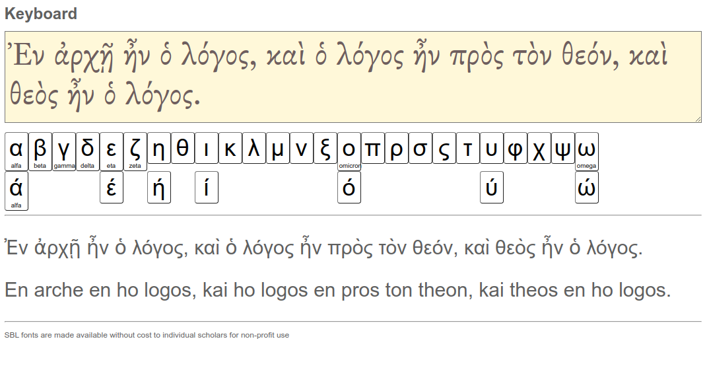

# Gedeonix Greek Lib (transcription of Greek into Polish)

Library of simple tools to support work on text in Greek (very early alpha)

## Demo
 Simple demo in ./public/keyboard.html file.
 

  
## Resource

### Unicode
- https://en.wikipedia.org/wiki/Unicode_and_HTML_for_the_Hebrew_alphabet
- https://en.wikipedia.org/wiki/Greek_diacritics
- https://en.wikipedia.org/wiki/Latin_script_in_Unicode

### SBL Fonts
Fonts are not a direct part of the library, they were used only for the demo code.

The project (non-profit) uses fonts from www.sbl-site.org
under license
> Fonts SBL fonts are made available without cost to individual scholars for non-profit use.
>
> www.sbl-site.org/educational/biblicalfonts.aspx

- manual https://www.sbl-site.org/Fonts/SBLHebrewManualv1.5.pdf
